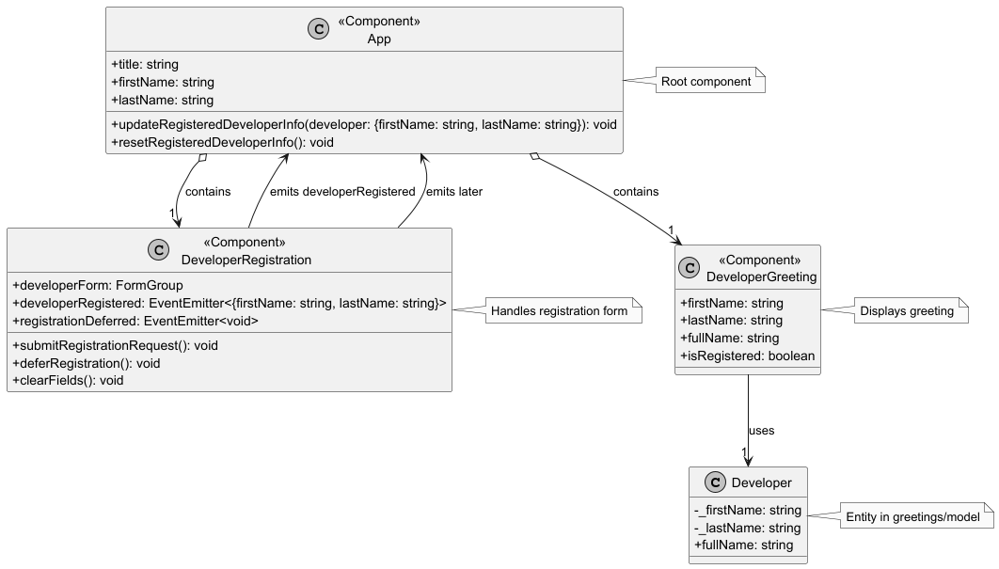

# Hello Angular Developer (hello-angular-developer)

## Overview

This project is a simple application designed to introduce the main concepts and capabilities of the Angular Framework.

## Features

It allows a visitor to register as a developer by entering their first and last names, demonstrating Angular core features through a practical greeting system within a domain-driven design structure.

This application showcases the following concepts:

- Standalone Components
- Reactive Forms
- Event Binding
- Control Flow with `@if`
- TypeScript Integration
- Domain-Driven Design (DDD)

## Prerequisites

- Node.js (v22+ recommended)
- npm (v10+ recommended)
- Angular CLI (`npm install -g @angular/cli`)

## Class Diagram

The following diagram illustrates the structure of the application, including the main components and their relationships:



Review the document [docs/class-diagram.md](docs/class-diagram.puml) for a detailed class diagram of the application.

## User Stories
Refer to [docs/user-stories.md](docs/user-stories.md) for a list of user stories that outline the functionality and features of the application.

## Setup

1. Clone the repository:
   ```bash
   git clone <repository-url>
   cd hello-angular-developer

2. Install dependencies:
   ```bash
   npm install
   ```
3. Start the development server:
   ```bash
    ng serve
    ```
4. Open your browser and navigate to `http://localhost:4200/` to view the application.
